# AWS EC2 Pricing Analysis — A Cost-Decision-Support Dashboard

A dbt + Power BI project that turns AWS's raw EC2 pricing feed into a structured warehouse and an interactive report for evaluating instance, OS, and licensing cost trade-offs.

## 1. Abstract

This project analyzes AWS EC2 pricing to find the cheapest optimal way to pay for an instance IT has already chosen. Four findings stand out: Windows costs 72% more than Linux on the same hardware; the license model — not the OS — is the single biggest cost lever, swinging the rate by as much as $0.67/hr on `m5.xlarge`; a 3-Year Reserved Instance discount ranges from ~9% (license-bundled) to over ~20% (unbundled), and can even bring a high-CapEx instance like `x2iedn.xlarge` below the plain Linux on-demand rate. For a given term, every payment option — Upfront, Partial, or No Upfront — lands within ~1.3% of the others in total cost, so the real decision is a liquidity trade-off, not a pricing one. Full breakdown, real numbers, and Power BI screenshots below.

## 2. Business Problem

Companies waste an estimated **29% of their cloud spend** ([Flexera, 2026](https://www.flexera.com/blog/finops/flexera-2026-state-of-the-cloud-report-the-convergence-of-cloud-and-value/)), often because a pricing decision isn't broken into its real cost components. Two examples from this project: Windows costs up to **72% more** than Linux on the same hardware, and committing to a Reserved Instance (RI) — a discounted rate in exchange for a 1- or 3-year usage commitment — can cut costs by **20% or more**, depending on how much of the price is licensing versus pure compute.

## 3. Business background

This project assumes IT has already decided the instance type and OS; it picks up from there, ingesting AWS's public EC2 pricing feed (130,441 pricing line items, 1,370 instance types), building a clean star schema in dbt, and surfacing it in Power BI as a decision-support tool for the optimal pricing — On-Demand vs. Reserved, License Included vs. BYOL, which region. That's built for answering: not "which instance should we run," but "given what IT needs, what's the optimal plan" — finding the real cost components behind a price and the optimal pricing plan.

*Dataset: [`justsahil/aws-pricing-dataset`](https://www.kaggle.com/datasets/justsahil/aws-pricing-dataset) on Kaggle, MIT licensed, pulled from AWS's official Pricing API. Credit to the original dataset author.*

## 4. Key Findings

### Windows Premium

- **Windows costs 72% more than Linux** on the same hardware — on-demand, no license or pre-installed software, averaged at the instance-type level across 944 matched instance types.

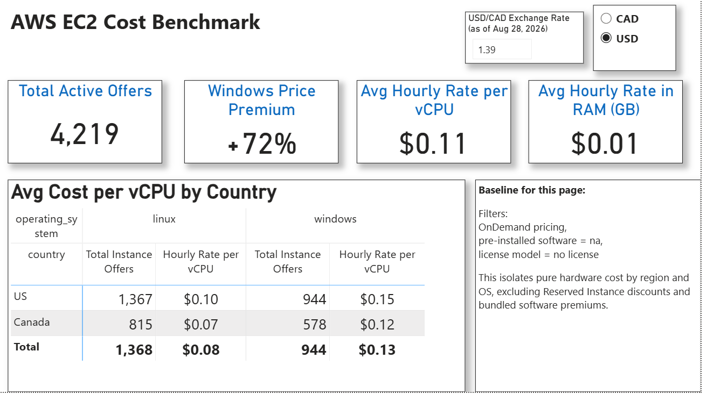
*Country × OS page — Windows Premium % KPI and per-vCPU cost table.*

### Cost Components

- **License model is the single biggest driver of Windows cost — as much as the OS premium and software premium combined.** 

| OS | Software | License Model | On-Demand Rate | vs. Linux Baseline |
|---|---|---|---|---|
| Linux | — (no software) | n/a | $0.19/hr | baseline |
| Linux | SQL Server Standard | No License Required | $0.67/hr | +$0.48/hr (software premium) |
| Windows | SQL Server Standard | No License Required | $0.86/hr | +$0.67/hr (Windows OS premium + software premium) |
| Windows | SQL Server Standard | License Included | $0.19/hr | +$0.00/hr — same as the bare Linux baseline, because license cost is folded into the SKU, not charged separately |

Refer to the "01 Linux Base" bar in the waterfall charts below for this baseline rate. The License Model step alone swings the price by $0.67/hr (from $0.86 down to $0.19) — matching the combined Windows OS premium ($0.18) and software premium ($0.48), because License Included effectively refunds both. 

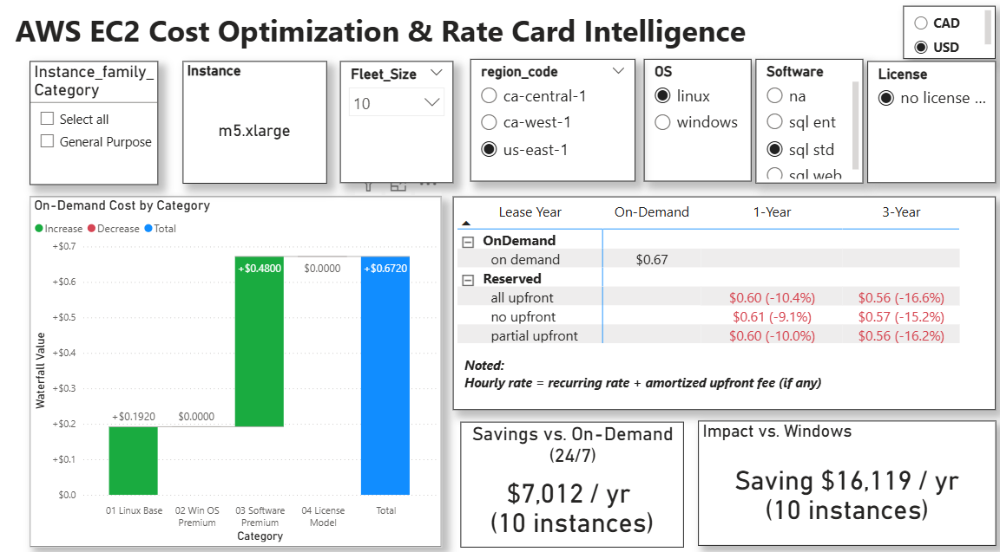
*Linux + SQL Server Standard baseline — on-demand $0.67/hr.*

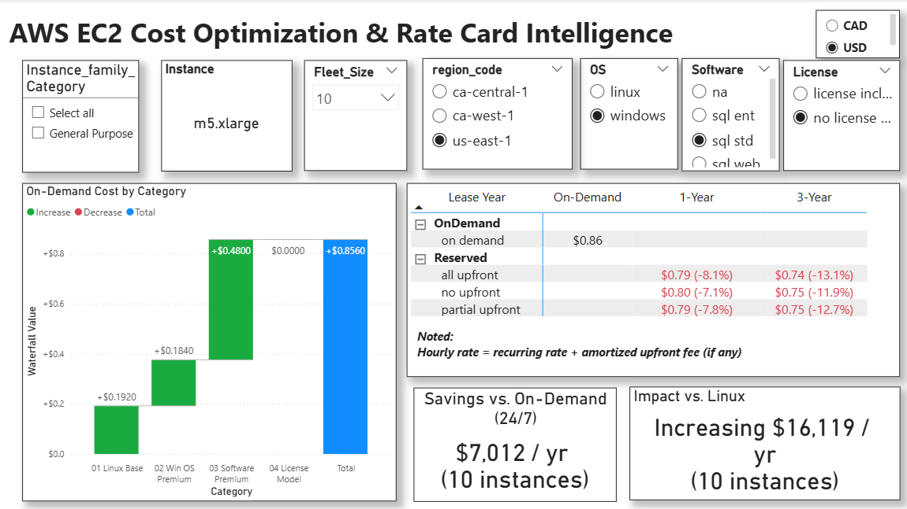
*Windows + SQL Server Standard, No License Required — on-demand $0.86/hr.*

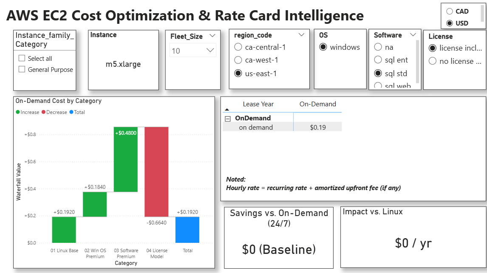
*Windows + SQL Server Standard, License Included — on-demand $0.19/hr (no Reserved-Instance pricing available for this combination in the source data).*

### Reserved Instance Discounts

- **Bundling a license shrinks that RI discount sharply.** Unbundled General Purpose instances save ~37–44% with a 3-Year RI; once SQL Server Standard licensing is bundled into the SKU, the discount drops to ~12–13% for the same term on `m5.xlarge` (~7–8% at 1-Year).

*Note: the hourly rate shown below = recurring rate + amortized upfront fee (where applicable).*

*Configuration: `m5.xlarge`, Windows, SQL Server Standard, No License Required, `us-east-1`, fleet of 10, USD.*

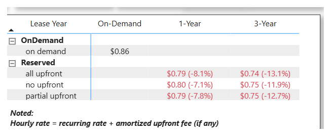
*Licensing & Reserved-Instance matrix page — `m5.xlarge` + SQL Server Standard, no-license-bundled example. Every plan now shows its own discount vs. On-Demand: ~11.9–13.1% at 3-Year, ~7.1–8.1% at 1-Year.*

- **The power of a long-term commitment depends on the instance.** For `m5.xlarge`, a 3-Year commitment still leaves the Windows rate above the Linux on-demand baseline ($0.74/hr vs. $0.67/hr) — the license premium shrinks but doesn't disappear. For `x2iedn.xlarge`, a larger, higher-CapEx instance, the same 3-Year commitment brings the Windows rate ($0.93/hr) *below* the Linux on-demand baseline ($1.31/hr) — a ~29% saving over just running Linux with no commitment at all.

*Configuration: `x2iedn.xlarge`, Windows, SQL Server Standard, No License Required, `us-east-1`, fleet of 10, USD.*

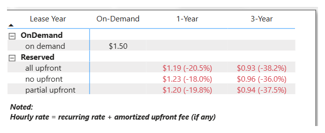
*Licensing & Reserved-Instance matrix page — `x2iedn.xlarge`, Windows + SQL Server Standard, no license bundled — on-demand $1.50/hr drops to $0.93/hr at 3-Year All Upfront (-38.2%), below the Linux on-demand rate of $1.31/hr.*

### Capital Allocation & Liquidity

- **The 3-Year plans cost almost the same in total — the real choice is when you pay, not what you pay.** For `m5.xlarge` (fleet of 10), 3-Year cumulative cost is $195,595 (All Upfront), $196,376 (Partial Upfront), and $198,151 (No Upfront) — within 1.3% of each other — despite Day-1 capital outlay ranging from $195,595 down to $0. The same holds at 1-Year: $206,640 (All Upfront), $207,325 (Partial Upfront), $208,926 (No Upfront) — within 1.1% of each other, Day-1 CapEx from $68,880 down to $0.
- **So this isn't really a "which plan is cheapest" decision — it's a liquidity trade-off.** Paying nothing upfront costs at most ~1.3% more over 3 years than paying the full CapEx on Day 1. A company with a better use for that capital elsewhere — funding another project, keeping a cash buffer — can reasonably choose No Upfront and treat that ~1% gap as the price of liquidity.
- **If capital is committed upfront, the breakeven period is what to watch.** All Upfront's $195,595 CapEx (3-Year) pays for itself by Month 32; the 1-Year All Upfront's smaller $68,880 CapEx pays back faster, by Month 12 (and again each renewal, Month 23 and 34). No Upfront plans have no CapEx to recover, so their savings apply from Month 1.

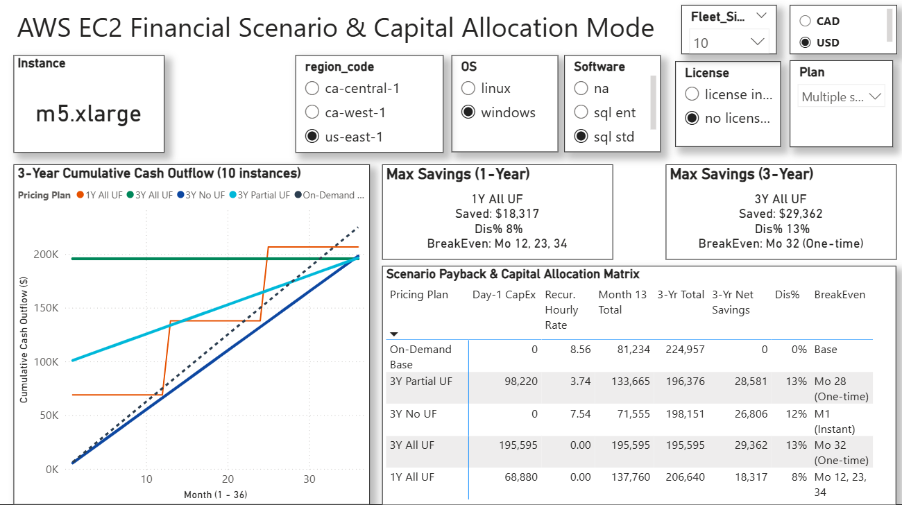
*Financial Scenario & Capital Allocation page — `m5.xlarge`, 3-Year plan variants (All/Partial/No Upfront) vs. On-Demand and 1-Year All Upfront.*

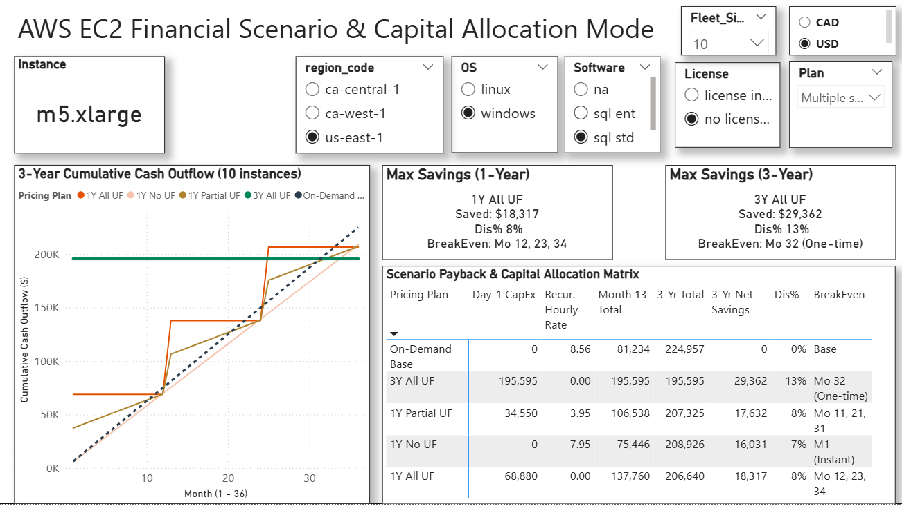
*Financial Scenario & Capital Allocation page — `m5.xlarge`, 1-Year plan variants (All/Partial/No Upfront) vs. On-Demand and 3-Year All Upfront.*

## 5. Python Cross-Validation & Regional Pricing Analysis

To close a Python credibility gap in this portfolio, I independently authored a pandas/scipy script (`python_check/outlier_and_regional_pricing.py`): cross-validating dbt's outlier logic with a different method, visualizing the result, and testing whether per-vCPU pricing differs by region.

### Outlier Detection & Cross-Validation

**Method:** Price rows were grouped by matching spec (region, OS, term, license, etc.) and classified by the % gap between the group's highest and lowest `price_per_hour`: `no peer` (single-price groups), `accept` (<50% gap), `abnormal` (≥50%).

**Limitation:** With only two price points, the method can flag a pair as abnormal but can't determine which row is the error — or rule out a legitimate, unknown pricing factor (e.g., regional capacity, negotiated rates) instead of a data issue.

**Validation against dbt:** Cross-tabulated against dbt's `is_price_outlier` flag, the method agrees 100% on dbt's one confirmed anomaly (`p5.4xlarge` at $0.70/hr next to a correct $7/hr peer). It also flags 106 more candidates at a 50% threshold; tightening to 100% converges to that same single record — the extra flags are a threshold effect, not a methodology disagreement.

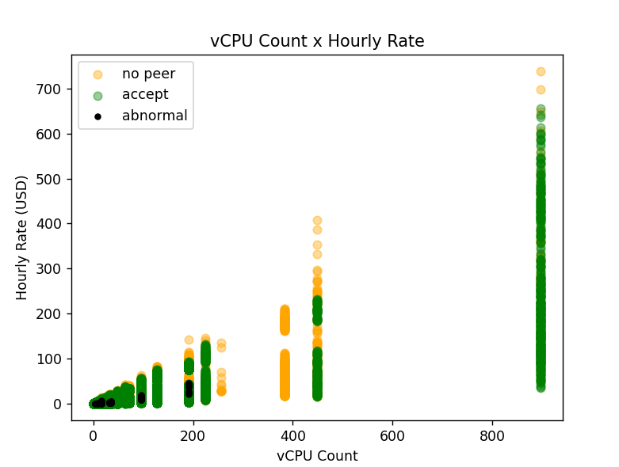
*Row-level classification vs. dbt's peer-group outlier test — deliberately complements, not duplicates, the aggregated per-vCPU/RAM view in the Power BI report.*

### Regional Pricing Comparison (Two-Sample Hypothesis Testing)

**Question:** Under a fixed instance spec and purchase option (Linux, 3-Year term, No Upfront, no pre-installed software, no license required), does average per-vCPU pricing differ between `us-east-1` and `ca-central-1`?

**Hypotheses:** H0 — average `price_per_vcpu` in `us-east-1` equals average `price_per_vcpu` in `ca-central-1`. H1 — the two are not equal (two-tailed).

**Method:** A single `instance_type` per region gives n=1–2 — too few for a t-test, and AWS list pricing is closer to a census than a sample at that grain. Instead, `price_per_vcpu` is compared across all `instance_type`s common to both regions (avoiding product-mix bias), using a Welch's t-test (unequal variance assumed). Scope: `us-east-1` vs. `ca-central-1` only.

**Result:** `us-east-1` averages $0.0292/vCPU-hr vs. `ca-central-1`'s $0.0321/vCPU-hr — `ca-central-1` is priced about 10.2% higher. The difference is statistically significant (t = -4.19, p ≈ 0.0000286, α = 0.05, two-tailed) → reject H0.

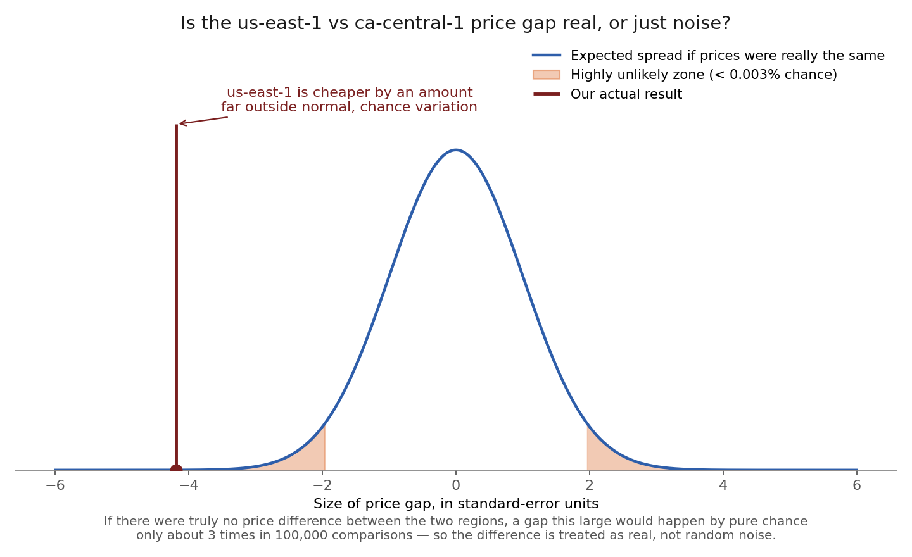
*If prices were really the same across regions, a gap this large would occur by chance only ~0.003% of the time.*

See `python_check/outlier_and_regional_pricing.py` for the full script.

## 6. Tech Stack

- **Ingestion:** `kagglehub` (dataset download) + `polars` (Parquet/CSV cleaning, snake_case standardization, categorical typing)
- **Transformation:** `dbt-core` + `dbt-duckdb` (staging → marts, tests, documentation)
- **Warehouse:** DuckDB (local, file-based)
- **BI / Reporting:** Power BI Desktop (PBIP format)
- **Data quality:** dbt generic tests (`unique`, `not_null`, `accepted_values`, `relationships`) + a custom singular test guarding `price_per_hour > 0`
- **Validation & Analysis:** `pandas`, `numpy`, `scipy` — independent Python cross-validation of dbt's outlier logic and a regional pricing hypothesis test; `matplotlib` for the accompanying visualization

## 7. Data Model (Star Schema)

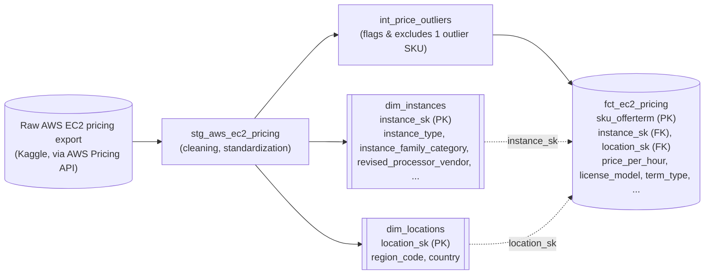

One fact table (`fct_ec2_pricing`, grained at one row per SKU + offer term, 130,441 rows) plus two deduplicated dimensions (`dim_instances`, `dim_locations`). For Reserved plans with an upfront fee, the raw feed carries two separate pricing rows per offer — one for the upfront fee and one for the recurring hourly rate — which `fct_ec2_pricing` sums together into a single row, so the grain stays one row per SKU + offer term rather than splitting into two. `dim_instances` also derives a custom instance-family classification (General Purpose, Compute Optimized, Memory Optimized, Storage Optimized, Accelerated Computing), modeled on AWS's own category naming — the middle rung of the OS → category → instance drill-down the report is built around.

## 8. Data Scope & Filters

- **Region** — `ca-central-1`, `ca-west-1`, and `us-east-1` (3 regions).
- **Tenancy** — Shared only (excludes Dedicated Host/Instance).
- **Operating System** — Linux and Windows only, ~60% of the raw dataset's OS values.
- **Term Type** — both On-Demand and Reserved (1-/3-Year) are included.
- **Capacity Status** — "Used" only, excluding capacity-reservation-only SKUs.
- This is a point-in-time pricing snapshot, not a live feed.

## 9. Approach

- **Price waterfall:** starting from a Linux, on-demand, no-license baseline, each step adds one cost driver (Windows premium → software premium → license model), so the composition of a Windows price is visible, not just the total.
- **Plan selection:** the Licensing & Reserved-Instance matrix page lays out On-Demand vs. 1-/3-Year Reserved (All/Partial/No Upfront) side by side, for a given instance and license combination.
- **Cash-flow modeling:** the Financial Scenario & Capital Allocation page tracks cumulative cash outflow per plan over 36 months, including when Day-1 CapEx is paid and when it breaks even — turning "which plan is cheapest" into "which plan fits the company's liquidity."
- **Data quality:** enforced with dbt tests — referential integrity on every foreign key, `accepted_values` on every categorical column used downstream, and a custom test guarding `price_per_hour > 0`. This caught a real issue: a `p5.4xlarge` row priced at $0.70/hr next to the correct $7/hr row, found via a statistical median-ratio outlier check and excluded in `int_price_outliers`. See Section 5 for an independent Python cross-validation of this same finding.

## 10. Beyond Price

- A 3-year Reserved Instance trades away flexibility: if the workload shrinks or moves, the reserved capacity goes unused; if it grows past what was reserved, the extra spills over to pricier On-Demand rates.
- Region choice isn't price-only either — latency to end users, and data-sovereignty or geopolitical policy, can outweigh a marginal price difference and are outside what this analysis prices in.

## 11. Future Enhancements: Adding Usage Analysis

The next step: pairing this pricing model with actual usage data (CPU/memory, idle time from CloudWatch or the AWS bill). That lets us compare instance choice against real utilization and right-size the fleet — upgrading, downgrading, or committing to Reserved terms — turning price analysis into an actionable capacity decision.

## 12. Contact

**Amy Fung** — [LinkedIn](https://www.linkedin.com/in/amyfung437)
